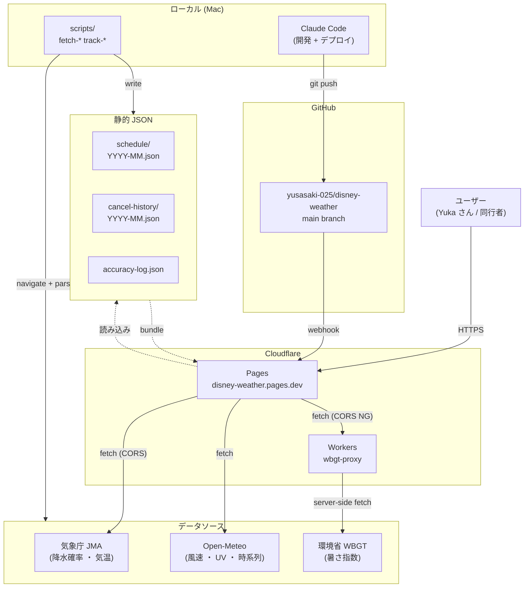
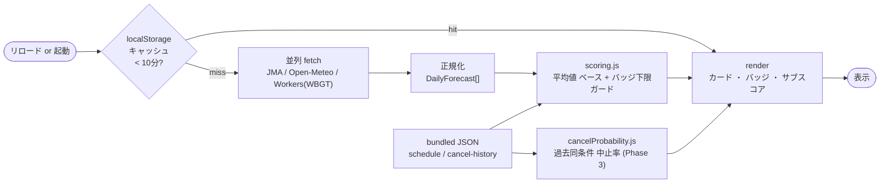
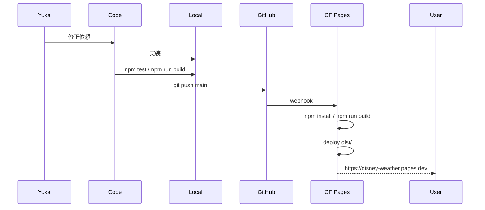

# マイハマびより アーキテクチャ

技術設計 ・ データフロー ・ ディレクトリ構成。
将来の開発者 (Claude / Yuka さん本人) が読み返すための内部ドキュメント。

---

## 1. システム全体図



---

## 2. データフロー (公開ページ)



---

## 3. ディレクトリ構成

```
disney-weather/
├── README.md                     ← 概要 ・ 運用フロー
├── package.json                  ← script 集約
├── vite.config.js                ← bundler 設定 (publicDir = public/)
├── docs/                         ← 設計 ・ マニュアル ・ 取得元 (.gitignore で PDF 除外)
│   ├── SPEC.md                   ← 機能仕様 (Cowork 側で更新)
│   ├── CHANGES.md                ← 変更履歴 §0.x (Claude 振り返り用)
│   ├── USER-MANUAL.md            ← 同行者向け
│   ├── ARCHITECTURE.md           ← この文書
│   └── cancel-history-pdf/       ← 元 PDF (.gitignore 対象)
├── public/                       ← 静的アセット (vite が dist/ にコピー)
│   ├── favicon.svg / .ico / .png ← favicon 一式
│   ├── apple-touch-icon.png      ← iOS PWA
│   ├── logo-mark.svg             ← ヘッダーロゴ
│   ├── og-image.png / .svg       ← OGP 1200x630
│   └── manifest.json             ← PWA マニフェスト
├── src/
│   ├── index.html
│   ├── main.js                   ← エントリーポイント
│   ├── styles.css
│   ├── config/
│   │   └── location.js           ← 観測地点コード集約
│   ├── data/                     ← データ層
│   │   ├── jma.js                ← 気象庁 fetch + 正規化
│   │   ├── openMeteo.js          ← Open-Meteo
│   │   ├── wbgt.js               ← 環境省 WBGT + 簡易計算 fallback
│   │   ├── showSchedule.js       ← getDaySchedule(date, park)
│   │   ├── show-thresholds.js    ← ショー別風キャン閾値
│   │   ├── schedule/             ← 月別ショー時刻 JSON
│   │   │   └── YYYY-MM.json
│   │   ├── cancel-history/       ← 過去風キャン記録
│   │   │   └── YYYY-MM.json
│   │   ├── operation-log/        ← 当日中止情報
│   │   │   └── YYYY-MM-DD.json
│   │   ├── forecast-snapshots/   ← 予報スナップショット (track-accuracy用)
│   │   │   └── YYYY-MM-DD.json
│   │   └── accuracy-log.json     ← 予報精度ログ
│   ├── score/
│   │   ├── scoring.js            ← 総合スコア + バッジ判定
│   │   └── cancelProbability.js  ← 過去同条件中止率 (Phase 3)
│   ├── ui/
│   │   ├── table.js              ← カレンダー + 詳細パネル
│   │   ├── header.js             ← ロゴ + 更新ボタン + ヘルプ
│   │   ├── filters.js            ← 並び順 ・ 絞り込み
│   │   ├── legend.js             ← スコア凡例カード
│   │   ├── top3.js               ← おすすめ TOP3
│   │   └── help.js               ← ヘルプモーダル
│   └── utils/
│       ├── date.js               ← JST 統一
│       ├── tempColor.js          ← 温度帯 → 色
│       ├── weatherIcon.js        ← 天気 → Material Symbol
│       ├── cache.js              ← localStorage キャッシュ
│       └── logger.js
├── scripts/                      ← 運用スクリプト (Node 直実行)
│   ├── fetch-schedule.mjs        ← 公式 calendar 取得 (Akamai NG)
│   ├── fetch-operation.mjs       ← 当日運営状況取得
│   ├── import-cancel-history.mjs ← PDF → JSON
│   ├── snapshot-forecast.mjs     ← 予報スナップショット
│   └── track-accuracy.mjs        ← 観測値比較
├── workers/                      ← Cloudflare Workers
│   ├── wbgt-proxy.js             ← 環境省 WBGT CORS バイパス
│   ├── openweather-proxy.js      ← OpenWeather API キー保護 (任意)
│   └── wrangler.toml
└── tests/
    └── ...                       ← Vitest 77 緑
```

---

## 4. 主要モジュール

### スコアリング (`src/score/scoring.js`)

```
1日のスコア = 100 - (風減点 ＋ 雨減点 ＋ 熱中症減点 ＋ 寒さ減点 ＋ UV減点)
+ バッジ下限ガード (§0.16) :
  worst severity が critical → max 25
  worst severity が danger → max 45
  worst severity が warn → max 65
```

算定窓 : 昼パレード時刻 (priority high) ±1h の **平均値** (§0.13.2、最大値は補助表示)。
ショー別閾値 (§0.30) で風バッジを判定。

### バッジ判定

| 種 | 入力 | 閾値ソース |
|---|---|---|
| 風 | gust_show_window (平均) | `src/data/show-thresholds.js` (過去 PDF 由来) |
| 雨 | pop_show_window + precip_max | 仕様書 §5.5 (固定) |
| 熱 | wbgt_show_window | 仕様書 §5.6 + 環境省基準 |

### 過去同条件中止率 (Phase 3 §0.31)

```js
getCancelProbability(showName, predictedMaxWind) -> {
  probability: 22,    // %
  sampleSize: 18,     // 過去同条件件数 (maxWind ±2m/s)
  cancelCount: 4
}
```

サンプル 20件未満 or 同条件 5件未満は null (誤情報回避)。

### 予報精度追跡 (Phase 2 第4弾 §0.29)

```
snapshot-forecast.mjs : 毎朝 forecast-snapshots/YYYY-MM-DD.json 保存
track-accuracy.mjs : 翌朝 実測値と比較 → accuracy-log.json 追記
```

ソース別 RMS / バイアス算出 → 30日蓄積で「予報精度ダッシュボード」(Phase 3 §0.32)。

---

## 5. データソース

| ソース | 認証 | CORS | 取得方法 |
|---|---|---|---|
| 気象庁 JMA | 不要 | OK | ブラウザから直接 |
| Open-Meteo | 不要 | OK | ブラウザから直接 |
| 環境省 WBGT | 不要 | **NG** | Cloudflare Workers プロキシ (`wbgt-proxy`) 経由 |
| OpenWeather (任意) | API キー | OK | プロキシ経由でキー保護 |
| TDR 公式 calendar | 不要 | (irrelevant) | **Akamai Bot Manager で自動取得 NG** ・ 手動 (Cowork Chrome MCP) |
| TDR 公式 operation | 不要 | (irrelevant) | 同上 |
| TSUBASA ブログ PDF | 不要 | (irrelevant) | Google Drive ダウンロード ・ pdftotext で抽出 |

### Akamai Bot Manager 対策

TDR 公式は WAF でカレンダー本文の自動取得を弾く。

対処 :
1. **Cowork Chrome MCP (Yuka さん個人 Chrome 経由)** → 通る (Phase 2 第1弾の取得実績)
2. ローカル Mac の Playwright → 弾かれる (Code 検証済)
3. Cloudflare Workers の fetch → 弾かれる
4. GitHub Actions Ubuntu の Playwright → 弾かれる可能性

→ 月初 ・ Yuka さん手動運用 (Cowork Chrome 経由) が現実解。

---

## 6. デプロイフロー



CF Pages 設定 :
- Build command : `npm run build`
- Output directory : `dist`
- (Deploy command は空 ・ Pages 標準デプロイ)

Workers デプロイは別途 `npx wrangler deploy --config wrangler.toml` (個人アカウント `Pi.pi.pi.025@gmail.com`)。

---

## 7. Phase 別実装履歴 (要点)

詳細は `docs/CHANGES.md` §0.1 〜 §0.35。

### Phase 0 (MVP, 半日)

- JMA + Open-Meteo 2ソース ・ テーブル表示 ・ 総合スコア

### Phase 1 (1-2日 ・ 公開ページ完成)

- TOP3 ハイライト ・ 詳細パネル ・ 服装サジェスト
- WBGT 簡易計算 ・ ハンバーガー削除 → ヘッダー2ボタンに簡素化
- スマホカード化 (grid-template-areas) ・ ロゴ ・ favicon ・ OGP
- §0.21 - §0.27 で各種 UI 改善

### Phase 2 (運用しながら強化)

1. **§0.8 日別ショースケジュール** ・ 月別 JSON + 公式取得バッジ
2. **§0.10 WBGT 環境省実値化** ・ Workers プロキシ + CSV ヘッダー誤認バグ修正
3. §0.28 公式運営状況蓄積 (仕様化 ・ ローカル運用)
4. **§0.29 予報精度追跡** ・ snapshot + track-accuracy + accuracy-log
5. **§0.30 過去風キャン記録統合** ・ アメブロ PDF 5ヶ月分 (2,111 records) + ショー別閾値

### Phase 3 (進行中)

1. §0.31 過去 N 日中 X% 中止表示 (cancel-history 活用)
2. §0.32 予報精度ダッシュボード (別 artifact)
3. §0.33 (α) 熱キャン ・ フレンジー追加 (Yuka さん画像 upload 運用)
4. §0.34 (ν) iOS PWA インストール促進
5. §0.35 (ξ) ヘルプ ・ FAQ 充実

---

## 8. 将来拡張案 (Phase 4 以降)

- LINE / Slack 通知 (決定日の 3日前 ・ 前日 ・ 当日朝)
- 多パーク展開 (USJ / 富士急 / 海外パーク)
- ML 中止予測 (cancel-history + 気象データで分類器)
- GitHub Actions cron 自動化 (snapshot-forecast ・ track-accuracy ・ operation-log)
- 同行者投票機能 (Workers KV ベース ・ Notion 廃止後の代替)
- パスポート ・ チケット ・ ホテル価格連動

---

## 9. 開発上の注意 (Claude 振り返り用)

### 規約 ・ ライセンス

- TDR 公式 : 個人利用 ・ 月1取得 ・ 出典明記 (規約遵守)
- 気象庁 / Open-Meteo / 環境省 : 政府標準利用規約 or CC BY 4.0
- アメブロ PDF : 第三者成果物のため repo に含めず (`.gitignore`) ・ 抽出後 JSON のみコミット
- X / Wix : 個人利用 ・ 出典明記 ・ 自動 scrape は規約注意

### 編集時のミス防止

- スマホ表示の検証は **Chrome DevTools の Device toolbar (375px iPhone エミュ) 必須** ・ ウィンドウ縮小だけだと CSS media query が効かないことがある
- CSS の `position: sticky` は親 overflow に注意 (overflow: auto がある親内では body スクロールに追従しない)
- Edit 後は grep か Read で反映確認 (silent fail がある)
- アイコンの Unicode fallback (✓ ✓ など同形) で混乱しないよう、複数アイコン使うときは形が違うものを (★ / ✓ / ⚠ / ⊘)

### コーディング規約

- 約物 : 中黒は半角 `･`、全角括弧禁止 (komorebi デザインルール)
- 絵文字 : 公開ページ ・ ドキュメントには使わない (Material Symbols で代用)
- 縦アクセントバー : AI 風になるので使わない (色 + 罫線 + 余白で区切る)

---

## 10. 参考リンク

- GitHub repo : <https://github.com/yusasaki-025/disney-weather>
- 公開ページ : <https://disney-weather.pages.dev>
- 仕様書 : `docs/SPEC.md`
- 変更履歴 : `docs/CHANGES.md`
- ユーザーマニュアル : `docs/USER-MANUAL.md`
